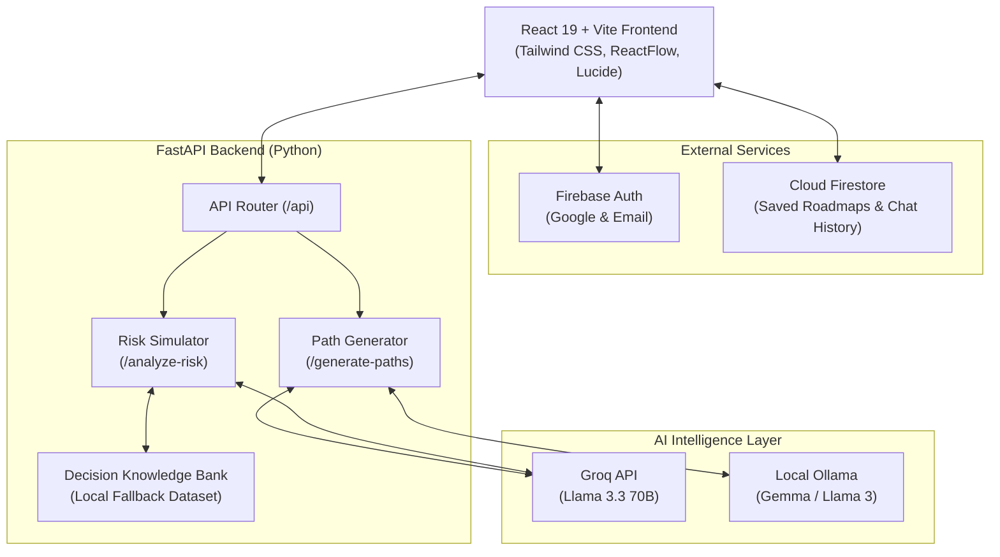

# Decision-IQ AI

<div align="center">


### **Your Intelligent Career Navigation System**

*An AI-powered decision intelligence platform guiding students and engineers toward optimal career trajectories through interactive roadmaps, risk simulation, and contextual AI mentoring.*

[](https://react.dev/)
[](https://vitejs.dev/)
[](https://fastapi.tiangolo.com/)
[](https://tailwindcss.com/)
[](https://firebase.google.com/)
[](https://groq.com/)
[](LICENSE)

[Live Demo](#deployment) • [Key Features](#-key-features) • [Architecture](#-architecture) • [Getting Started](#-getting-started) • [API Reference](#-api-endpoints)

---

</div>

## 📌 Overview

**Decision-IQ AI** solves one of the hardest challenges engineering students and professionals face: **career direction paralysis and fragmented learning roadmaps**. 

Instead of static, one-size-fits-all syllabi, Decision-IQ synthesizes personal starting points, aspirations, and industry skill trees into **interactive, dynamic career trajectories**. It models career pivots, diagnoses potential burnout and market obsolescence risks before they happen, and tracks milestone progress in real-time.

---

## ✨ Key Features

### 🗺️ Interactive Path Builder & Roadmap Canvas
- **Dynamic Node-Based Graph**: Visualizes learning stages, core skills, subtopics, and career milestone targets using **ReactFlow** and automated **Dagre** hierarchical graph layout.
- **Granular Progress Tracking**: Track module completion, mark mastered skills, and calculate active roadmap completion percentages.

### ⚡ AI-Powered Path Generation
- **High-Velocity Cloud AI**: Integrated with **Groq Cloud API** running `llama-3.3-70b-versatile` to synthesize detailed, personalized step-by-step career syllabi in seconds.
- **Local LLM Support**: Built-in support for **Ollama** (`gemma4` / `llama3`) for offline and self-hosted environments.

### 🛡️ Career Risk Simulator & 6-Month Projection
- **Pivot Risk Assessment**: Analyzes intended career switches and evaluates risk level (`HIGH`, `MEDIUM`, `LOW`).
- **Month-by-Month Simulation**: Predicts 6-month trajectory friction, identifies root causes, and provides safe, actionable alternative routes.
- **Offline Decision Data Bank**: Fallback similarity engine matched against hundreds of verified engineering career scenarios via Jaccard-overlap scoring.

### 🤖 AI Guide Assistant
- Real-time conversational guidance tailored to the user's selected active roadmap and career goals.

### 🔒 Cloud Synchronization & Authentication
- **Firebase Authentication**: Email/Password authentication and one-click Google OAuth sign-in.
- **Cloud Firestore**: Seamless cloud synchronization of custom roadmaps, user profiles, and active career paths across devices.

### 🎨 Modern Cyber / Aurora Aesthetics
- Responsive dark-mode and aurora glassmorphism interface built with Tailwind CSS v4 and Lucide icons.

---

## 🏛️ Architecture



---

## 🛠️ Tech Stack

| Layer | Technologies |
| :--- | :--- |
| **Frontend Framework** | [React 19](https://react.dev/) with [Vite](https://vitejs.dev/) |
| **Styling & UI** | [Tailwind CSS v4](https://tailwindcss.com/), [Lucide React](https://lucide.dev/), Glassmorphism |
| **Graph & Flow** | [ReactFlow 11](https://reactflow.dev/), [Dagre](https://github.com/dagrejs/dagre) layout engine |
| **Authentication & DB** | [Firebase 12](https://firebase.google.com/) (Auth & Cloud Firestore) |
| **Backend API** | [FastAPI](https://fastapi.tiangolo.com/) (Python 3.10+), [Uvicorn](https://www.uvicorn.org/) |
| **AI / LLM Providers** | [Groq Cloud](https://groq.com/) (`llama-3.3-70b-versatile`), [Ollama](https://ollama.com/) |
| **HTTP Clients** | [HTTPX](https://www.python-httpx.org/) (Async Python), Fetch API |
| **Deployment** | [Vercel](https://vercel.com/) (Vite Static Build + Python Serverless API) |

---

## 🚀 Getting Started

### Prerequisites
- **Node.js**: v18.0.0 or higher
- **Python**: v3.10 or higher
- **Git**
- Optional: [Ollama](https://ollama.com/) for local offline model execution

---

### 1. Clone the Repository
```bash
git clone https://github.com/Manindra-babu/Decision-IQ.git
cd Decision-IQ
```

---

### 2. Frontend Setup

1. Install frontend dependencies:
   ```bash
   npm install
   ```

2. Create a `.env` file in the root directory:
   ```env
   # API Backend URL (defaults to localhost:8000 in dev)
   VITE_API_URL=http://localhost:8000/api

   # Firebase Configuration (Optional: mock mode activates if omitted)
   VITE_FIREBASE_API_KEY=your_firebase_api_key
   VITE_FIREBASE_AUTH_DOMAIN=your_project.firebaseapp.com
   VITE_FIREBASE_PROJECT_ID=your_project_id
   VITE_FIREBASE_STORAGE_BUCKET=your_project.appspot.com
   VITE_FIREBASE_MESSAGING_SENDER_ID=your_sender_id
   VITE_FIREBASE_APP_ID=your_app_id
   ```

3. Launch Vite development server:
   ```bash
   npm run dev
   ```
   *Frontend starts at `http://localhost:5173`.*

---

### 3. Backend Setup

1. Navigate to the backend directory:
   ```bash
   cd backend
   ```

2. Create and activate a Python virtual environment:
   ```bash
   # Windows (PowerShell)
   python -m venv venv
   .\venv\Scripts\Activate.ps1

   # macOS / Linux
   python3 -m venv venv
   source venv/bin/activate
   ```

3. Install required Python packages:
   ```bash
   pip install -r requirements.txt
   ```

4. Create a `.env` file inside `backend/`:
   ```env
   # Groq API Key (Recommended for high-speed cloud generation)
   GROQ_API_KEY=your_groq_api_key

   # Optional: Local Ollama settings
   OLLAMA_IP=127.0.0.1
   OLLAMA_MODEL=gemma4:latest
   ```

5. Launch the FastAPI server:
   ```bash
   uvicorn main:app --host 0.0.0.0 --port 8000 --reload
   ```
   *Backend API runs at `http://localhost:8000` (Interactive Docs: `http://localhost:8000/docs`).*

---

## 📡 API Endpoints

| Method | Endpoint | Description |
| :--- | :--- | :--- |
| `POST` | `/api/generate-paths` | Generates a structured multi-stage career roadmap JSON from start to target goal |
| `POST` | `/api/analyze-risk` | Evaluates career pivot risk and produces 6-month trajectory forecasts |
| `POST` | `/api/assistant` | Contextual AI chat assistant for career mentoring |
| `POST` | `/api/save-roadmap` | In-memory roadmap save endpoint |
| `GET` | `/api/saved-roadmaps` | Retrieves saved roadmaps |
| `GET` | `/api/test-ai` | Verifies connectivity with local Ollama server |
| `GET` | `/docs` | Swagger UI interactive API documentation |

---

## 🌐 Deployment

The application is preconfigured for deployment on **Vercel** with a unified [`vercel.json`](./vercel.json):
- Static build output directory: `dist/`
- Serverless Python API routing: `/api/(.*) -> backend/main.py`

To deploy:
1. Push repository to GitHub.
2. Import project into Vercel.
3. Configure environment variables in Vercel project settings (`GROQ_API_KEY`, `VITE_FIREBASE_*`).
4. Trigger deploy!

---

## 📄 License

This project is licensed under the [MIT License](LICENSE).

---

<div align="center">
Built with 💙 by <a href="https://github.com/Manindra-babu">Manindra Babu</a> for the future generation of software engineers.
</div>
